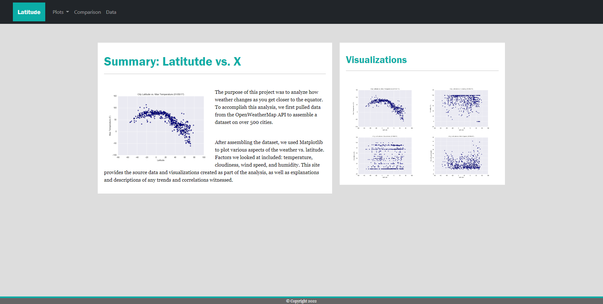

# Web Design Challenge
This is an assignment for the University of Minnesota Data Analytics and Visualization Boot Camp.

## Instructions

Create a website by using either the visualizations that you created for your Python-APIs Challenge or the weather data and images that are provided for this Challenge. To do so, use the considerations and website requirements that the following subsections describe. Also, ensure that your repository has regular commits and a descriptive README.md file.

>>*Note: As you build this dashboard, you'll create a page for each plot and a way to navigate among these pages. These pages should contain the visualizations and the descriptions. You’ll also create two more pages. One will be a landing page that provides a comparison of all the plots. The other will be a page that presents the data used to build the plots.*

**Considerations**
- Be aware that you must use Bootstrap. This includes using the Bootstrap navbar component for the header on every page, the Bootstrap grid for responsiveness on the comparison page, and the Bootstrap table component for the data page.
- Be aware that you must deploy your website to GitHub Pages, and that as a result, the website must work at a live, publicly accessible URL.
- Make sure to use a CSS media query that uses Bootstrap and/or @media for the navigation bar.
- Make sure that your website works at all window widths.
- Feel free to take some liberties with the visual aspects, but keep the core functionality the same as the instructions describe. (For example, keep the comparison visualizations on the comparison page.)

## Requirements

### Major Requirements
The overall requirements for your website are as follows:
- Your website must consist of seven pages.
- At the top of every page, your website must have a navigation bar.
- Your website must be deployed to GitHub Pages.

### Requirement Details

Your website must consist of seven pages as follows:
- A **landing page** that contains the following elements:
    - An explanation of the project.
    - A link to each visualization page. For these, a sidebar should contain a preview image of each visualization. Clicking an image should take the user to that visualization.

- Four **visualization pages**, stored in the visualizations folder, each with the following elements:
    - A descriptive title and a heading tag.
    - The visualization for the selected comparison (latitude vs. max temperature, latitude vs. humidity, latitude vs. cloudiness, or latitude vs. wind speed). The images that these pages display should be stored in the assets/images folder.
    - A paragraph describing the visualization and its significance.

- A **comparisons page** that does the following:
    - Contains all the visualizations on the same page so that people can easily compare them.
    - Uses a Bootstrap grid for the visualizations. This grid must contain two visualizations across a medium or large screen and one visualization across an extra-small or small screen.

- A **data page** that displays a responsive table containing the data that the visualizations use, as follows:
    - The table must be a Bootstrap table component.
    - The data must come from either exporting or converting the CSV file to HTML. To do so, try using a tool that you already know: Pandas. Pandas has a to_html method that generates an HTML table from a Pandas DataFrame. To learn more, see pandas.DataFrame.to_html Links to an external site.in the official Pandas documentation.

At the top of every page, your website must have a **navigation bar** that does the following:
- Contains the name of the site on the left side of the navigation bar, allowing users to return to the landing page from any page.
- Contains a drop-down menu, named Plots, on the right side of the navigation bar that contains a link to each visualization page.
- Provides two more text links on the right side: Comparisons, which links to the comparisons page, and Data, which links to the data page.
- Is responsive (via media queries). Note that the navigation bar must resemble the one in the screenshots in the Navigation Bar section. In particular, notice the background color change.

Your website must be deployed to GitHub Pages:
- As a result, the website must work at a live, publicly accessible URL. Save this URL for your later submission.